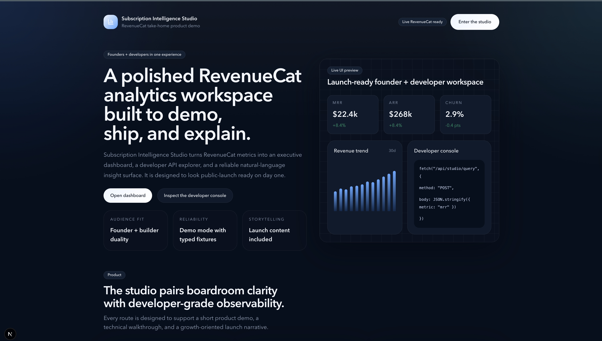
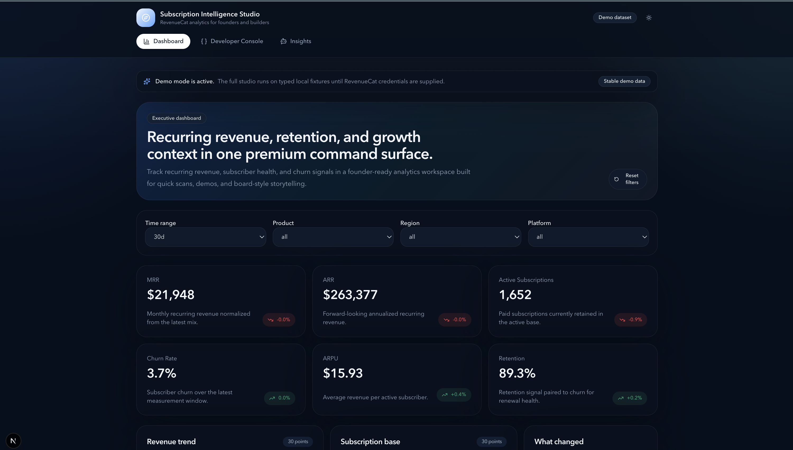
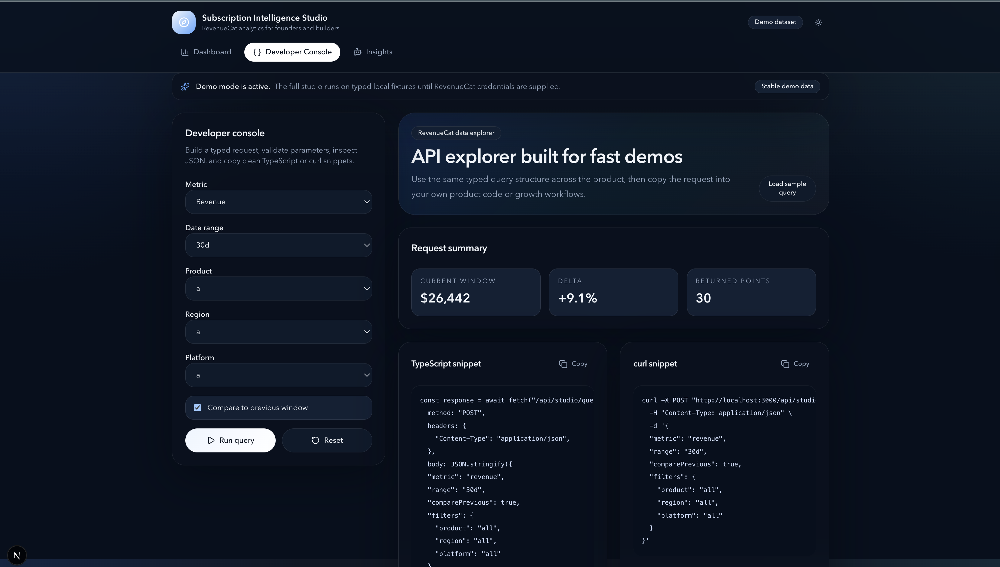

# Subscription Intelligence Studio

Subscription Intelligence Studio is a polished, dual-audience analytics product built for the RevenueCat Agentic AI Developer & Growth Advocate take-home. It combines a founder-ready subscription dashboard, a developer console for request exploration, and a deterministic natural-language insight workflow in one Next.js application.

The repo is packaged as a full submission, not just a working app. In addition to the product, it includes a launch blog post, a video walkthrough package, social launch drafts, a growth campaign report, a process log, normalized demo assets, and a final submission document.


## Product overview

The app is designed for two audiences:

- founders and growth operators who need fast signal on recurring revenue health
- developers and AI builders who need transparent request contracts, reusable snippets, and a reliable insight layer

Core capabilities:

- landing page with clear founder and developer positioning
- executive dashboard with KPI cards, filters, charts, and "what changed" context
- developer console with validated request building, JSON output, and copyable TypeScript and `curl`
- deterministic natural-language insights that map prompts to known metrics and evidence
- automatic demo mode fallback when RevenueCat credentials are absent
- unit, component, integration, and Playwright e2e coverage

## Screenshots

Canonical screenshots for launch materials live in [`public/demo-assets`](./public/demo-assets/README.md).







## Routes

- `/`
- `/studio`
- `/studio/dashboard`
- `/studio/console`
- `/studio/insights`
- `/api/studio/dashboard`
- `/api/studio/query`
- `/api/studio/insights`

## Tech stack

- Next.js App Router
- TypeScript
- React
- Tailwind CSS
- Recharts
- TanStack Query
- Zod
- React Hook Form
- Vitest and React Testing Library
- Playwright
- ESLint and Prettier

## Local setup

1. Install dependencies.

```bash
npm install
```

2. Copy the environment template.

```bash
cp .env.example .env.local
```

3. Start the app.

```bash
npm run dev
```

4. Open `http://localhost:3000`.

## Environment variables

The application automatically uses demo mode when the RevenueCat credentials are missing.

```env
REVENUECAT_API_KEY=
REVENUECAT_PROJECT_ID=
REVENUECAT_API_BASE_URL=https://api.revenuecat.com/v2
REVENUECAT_OVERVIEW_PATH_TEMPLATE=/projects/{projectId}/metrics/overview
REVENUECAT_CHART_PATH_TEMPLATE=/projects/{projectId}/charts/{metric}
NEXT_PUBLIC_SITE_URL=http://localhost:3000
```

## Demo mode

Demo mode is the default local experience and a first-class product path.

- typed fixtures power all primary routes
- the UI clearly labels when demo mode is active
- automated tests run against deterministic demo data
- reviewers can evaluate the product without secrets

## Architecture overview

```text
app/
components/
features/
hooks/
lib/
types/
tests/
e2e/
content/
public/demo-assets/
```

Key implementation decisions:

- server-side adapters isolate live RevenueCat credentials
- a demo adapter keeps every user flow available without secrets
- feature modules keep route files thin and maintainable
- shared UI primitives keep interaction patterns consistent
- the insight engine uses deterministic intent mapping instead of an external LLM

## Commands

```bash
npm run lint
npm run typecheck
npm run test
npm run test:e2e
npm run build
```

## Deployment notes

- deploy on Vercel or any compatible Node environment
- provide RevenueCat environment variables only if live mode is desired
- without credentials, the deployed app remains demoable through the fixture layer

